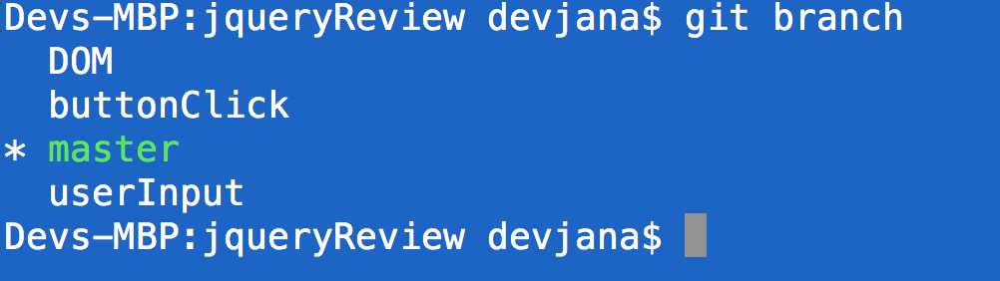
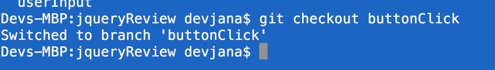
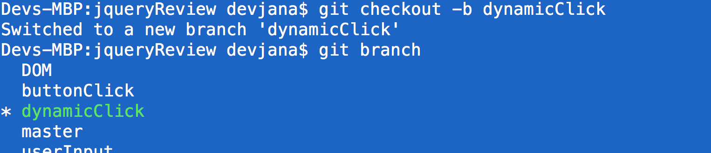
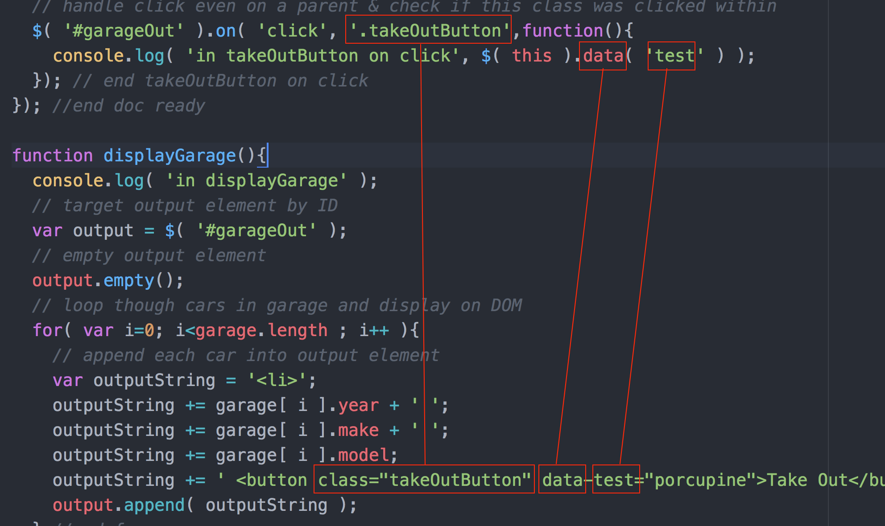
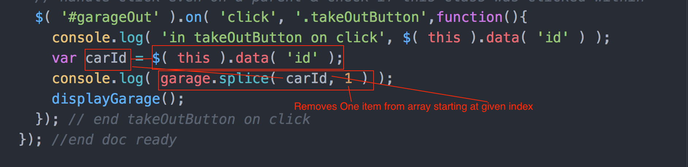

Gacrux JQuery Review
===

Morning Lecture:
---

Review of the following:

- sourcing JS, JQ
- button click
- retrieved user input via targeting elements by id & using .val()
- looped through and displayed on DOM with .empty() and .append( STRING );
- using .val( '' ) as a "setter"

git branches:

- git branch: lists existing branches and displays on which one you are

- git checkout: will move from one branch to another existing branch

- git checkout -b BRANCHNAME: will create a new branch

- git merge BRANCHNAMEWITHOTHERCODE: merges in code from another branch

basic workflow:

- create a new feature branch (git checkout -b BRANCHNAME)
- do your work on this branch
- add/commit as usual
- checkout master (git checkout master)
- merge in changes from feature branch (git merge BRANCHNAME)

Afternoon lecture:
---

- handle dynamically created element clicks
- get data from dynamically created elements $( this ).data( DATANAME )

- splice out a given car from the garage array

